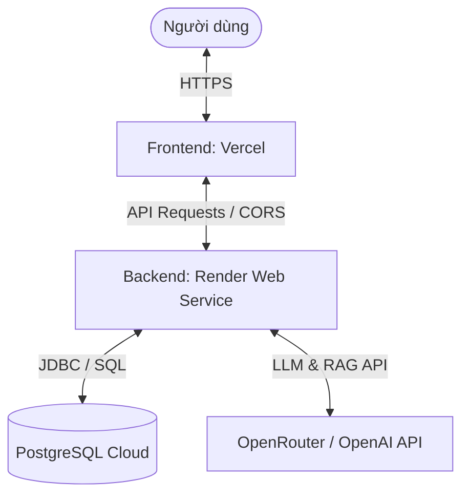

# 🚀 HƯỚNG DẪN CẤU HÌNH & DEPLOY HỆ THỐNG
## (Vercel Frontend & Render Backend + Database)

Tài liệu này hướng dẫn chi tiết cách cấu hình và triển khai (deploy) ứng dụng của bạn lên môi trường Production. Hệ thống được chia tách thành hai phần độc lập nhằm tối ưu hiệu năng và chi phí:
1. **Frontend (React + Vite + TypeScript)**: Deploy lên **Vercel** (Miễn phí, tốc độ CDN cực nhanh, hỗ trợ tối ưu cho Single Page App).
2. **Backend (Spring Boot + Java 21)**: Deploy lên **Render** dưới dạng **Docker Service** (Giúp môi trường chạy nhất quán, không lo lỗi sai phiên bản Java 21).
3. **Database (PostgreSQL)**: Deploy lên **Render PostgreSQL** hoặc các dịch vụ đám mây miễn phí như **Neon.tech** / **Supabase**.

---

## 🗺️ Sơ đồ Kiến trúc Triển khai (Deployment Architecture)



---

## 🛠️ PHẦN 1: CẤU HÌNH LIÊN KẾT HỆ THỐNG (Môi trường Production)

### 1.1 Cấu hình CORS ở Backend (Cho phép Frontend truy cập)
Hiện tại, file [SecurityConfig.java](file:///c:/WorkSpace/Web/Website-Analysis-and-Search-Career/backend/src/main/java/com/jobportal/security/SecurityConfig.java) của bạn đang giới hạn cứng danh sách CORS cho `localhost`. Khi deploy lên Vercel, ứng dụng frontend sẽ có tên miền dạng `https://ten-du-an.vercel.app`.

👉 **Cách giải quyết chuyên nghiệp:** Cấu hình danh sách Origins qua Environment Variable trong [application.properties](file:///c:/WorkSpace/Web/Website-Analysis-and-Search-Career/backend/src/main/resources/application.properties):

1. Thêm cấu hình này vào cuối file `application.properties`:
   ```properties
   # Cho phép cấu hình CORS linh hoạt qua biến ALLOWED_ORIGINS, mặc định là các cổng chạy local
   cors.allowed-origins=${ALLOWED_ORIGINS:http://localhost:3000,http://localhost:5173,http://127.0.0.1:5173}
   ```
2. Cập nhật [SecurityConfig.java](file:///c:/WorkSpace/Web/Website-Analysis-and-Search-Career/backend/src/main/java/com/jobportal/security/SecurityConfig.java) để đọc cấu hình động này:
   ```java
   @Value("${cors.allowed-origins}")
   private String allowedOrigins;

   @Bean
   public CorsConfigurationSource corsConfigurationSource() {
       CorsConfiguration configuration = new CorsConfiguration();
       // Tách chuỗi được cấu hình thành danh sách
       configuration.setAllowedOrigins(Arrays.asList(allowedOrigins.split(",")));
       configuration.setAllowedMethods(Arrays.asList("GET", "POST", "PUT", "PATCH", "DELETE", "OPTIONS"));
       configuration.setAllowedHeaders(Arrays.asList("*"));
       configuration.setExposedHeaders(Arrays.asList("x-auth-token", "Cache-Control", "Content-Type"));
       configuration.setAllowCredentials(true);
       
       UrlBasedCorsConfigurationSource source = new UrlBasedCorsConfigurationSource();
       source.registerCorsConfiguration("/**", configuration);
       return source;
   }
   ```
*(Lưu ý: Đừng quên thêm `@Value` import: `import org.springframework.beans.factory.annotation.Value;`)*

---

## 🖥️ PHẦN 2: DEPLOY BACKEND & DATABASE TRÊN RENDER

Render là nền tảng đám mây tuyệt vời để chạy Java Spring Boot nhờ tính năng tự động build Dockerfile.

### 📌 Bước 2.1: Tạo Database PostgreSQL
Bạn có thể dùng cơ sở dữ liệu tích hợp sẵn của Render hoặc một bên thứ 3 (như Neon.tech hoặc Supabase - được khuyên dùng vì Render PostgreSQL bản Free sẽ bị xóa sau 90 ngày).

**Nếu dùng Render PostgreSQL:**
1. Đăng nhập vào [Render Dashboard](https://dashboard.render.com/).
2. Click **New** ➔ Chọn **PostgreSQL**.
3. Điền thông tin:
   * **Name**: `jobpilot-db`
   * **Database Name**: `jobpilot`
   * **User**: `postgres`
   * **Region**: Chọn khu vực gần bạn nhất (ví dụ: `Singapore` hoặc `Oregon`).
4. Click **Create Database**.
5. Sau khi tạo xong, cuộn xuống phần **Connection** và sao chép đường dẫn **Internal Database URL** (dùng nếu backend cũng chạy trên Render) hoặc **External Database URL** (dùng để test từ local).
   * Định dạng chuẩn: `postgres://<username>:<password>@<host>/<database>`

---

### 📌 Bước 2.2: Deploy Web Service Backend (sử dụng Docker)
Chúng tôi đã tạo sẵn file [Dockerfile](file:///c:/WorkSpace/Web/Website-Analysis-and-Search-Career/backend/Dockerfile) tối ưu chuẩn Production cho bạn ở thư mục `backend/`.

1. Truy cập Render Dashboard ➔ Click **New** ➔ Chọn **Web Service**.
2. Kết nối với tài khoản GitHub/GitLab của bạn và chọn Repository của dự án này.
3. Cấu hình các thông số cơ bản:
   * **Name**: `jobpilot-backend`
   * **Region**: Chọn cùng khu vực với Database để giảm độ trễ kết nối.
   * **Branch**: `main` (hoặc nhánh chứa code mới nhất của bạn).
   * **Root Directory**: `backend` *(Cực kỳ quan trọng để Render cô lập thư mục backend)*.
   * **Runtime**: **Docker** *(Render sẽ tự động tìm thấy `backend/Dockerfile` của bạn)*.
   * **Instance Type**: Chọn **Free** (hoặc gói phù hợp).

4. Cuộn xuống và click vào nút **Advanced** để cấu hình **Environment Variables (Biến môi trường)**:

| Tên biến (Key) | Giá trị ví dụ | Ý nghĩa / Hướng dẫn |
| :--- | :--- | :--- |
| `SPRING_DATASOURCE_URL` | `jdbc:postgresql://<host>:<port>/jobpilot` | Đường dẫn JDBC tới database cloud của bạn. (Lưu ý: Thay thế tiền tố `postgres://` của URL render thành `jdbc:postgresql://` để Spring Boot hiểu). |
| `SPRING_DATASOURCE_USERNAME` | `postgres` | Username kết nối Database. |
| `SPRING_DATASOURCE_PASSWORD` | `mật_khẩu_db_của_bạn` | Password kết nối Database. |
| `JWT_SECRET_KEY` | `MôtChuỗiKýTựBảoMậtRấtDàiVàKhôngĐượcTiếtLộNày` | Khóa bí mật JWT tối thiểu 256-bit để mã hóa token đăng nhập. |
| `OPENAI_API_KEY` | `sk-or-v1-xxxx...` | API Key của OpenRouter (hoặc OpenAI) phục vụ AI Chatbot & RAG. |
| `ALLOWED_ORIGINS` | `https://ten-mien-frontend-cua-ban.vercel.app` | Đường dẫn frontend trên Vercel sau khi deploy (sẽ lấy ở Phần 3). |

5. Click **Create Web Service**. Render sẽ tải mã nguồn từ repo của bạn, tự động build image Docker và khởi chạy.

---

## 🎨 PHẦN 3: DEPLOY FRONTEND TRÊN VERCEL

Vite React App hoạt động cực tốt trên Vercel. Chúng tôi cũng đã cấu hình sẵn file [vercel.json](file:///c:/WorkSpace/Web/Website-Analysis-and-Search-Career/frontend/vercel.json) giúp bạn điều hướng mượt mà client-side routing (sửa triệt để lỗi reload trang ra 404).

### 📌 Các bước thực hiện:
1. Đăng nhập vào [Vercel](https://vercel.com/).
2. Click **Add New** ➔ Chọn **Project**.
3. Import Repository chứa dự án của bạn từ GitHub.
4. Cấu hình dự án:
   * **Project Name**: `jobpilot-frontend`
   * **Framework Preset**: **Vite** (Vercel tự động nhận diện).
   * **Root Directory**: Click chọn **Edit** và trỏ vào thư mục `frontend` của dự án.
5. Cuộn xuống phần **Build and Development Settings**:
   * Giữ nguyên cấu hình mặc định (Build Command: `npm run build`, Output Directory: `dist`).
6. Cuộn xuống phần **Environment Variables**:
   * Thêm biến môi trường để trỏ API tới Backend đã chạy trên Render:
     * **Key**: `VITE_API_URL`
     * **Value**: Nhập địa chỉ Public URL của Web Service Render bạn vừa tạo ở Bước 2 (VD: `https://jobpilot-backend.onrender.com`).
7. Click **Deploy**. Vercel sẽ tự động cài đặt các node_modules, build code tĩnh và phát hành tên miền công khai cho bạn (VD: `https://jobpilot-frontend.vercel.app`).

> [!IMPORTANT]
> **Bước Hoàn Tất:** Sau khi Vercel cấp tên miền cho bạn (ví dụ `https://jobpilot-frontend.vercel.app`), hãy quay lại Render Backend Dashboard, vào mục **Settings ➔ Environment Variables** và cập nhật giá trị biến `ALLOWED_ORIGINS` bằng tên miền Vercel này để hoàn tất kết nối bảo mật CORS!

---

## 💡 CÁC LƯU Ý QUAN TRỌNG VỀ RAG & VECTOR DATABASE Ở PRODUCTION

> [!WARNING]
> **Bộ nhớ Ephemeral (Tạm thời) của Render Free Tier:**
> * File RAG của bạn hiện đang cấu hình lưu trữ tại `src/main/resources/rag-data` trên ổ đĩa local.
> * Trên Render Free Tier, ổ đĩa của container là **tạm thời** (ephemeral). Mỗi khi bạn cập nhật code, deploy mới, hoặc container tự động khởi động lại sau một thời gian không hoạt động (sleep), toàn bộ dữ liệu ghi mới trên đĩa local sẽ bị **xóa sạch**.
> 
> **💡 Các giải pháp khắc phục đề xuất:**
> 1. **Dữ liệu tĩnh cố định:** Đảm bảo các file tài liệu raw (như PDF, TXT hướng dẫn tuyển dụng, ATS...) được đóng gói sẵn trong thư mục `src/main/resources/rag-data` của ứng dụng trước khi commit lên Git. Khi container khởi động lại, Java sẽ đọc trực tiếp từ classpath để nạp lại tự động mà không sợ mất file gốc.
> 2. **Sử dụng Cloud Vector DB:** Khi phát triển các tính năng RAG nâng cao cho phép người dùng tự tải CV lên lưu trữ lâu dài, hãy cấu hình lưu trữ file trên Amazon S3 / Cloudinary và lưu vector embeddings trên các dịch vụ cơ sở dữ liệu vector như **Supabase pgvector**, **Pinecone**, hoặc **Qdrant Cloud** (đều có gói miễn phí).

---

## 🔍 HƯỚNG DẪN KIỂM TRA & GIÁM SÁT (TROUBLESHOOTING)

* **Xem log Backend:** Vào Render Web Service ➔ Chọn tab **Logs** để kiểm tra quá trình Spring Boot khởi động, kết nối Database và kết nối OpenRouter.
* **Xem lỗi Frontend:** Mở F12 trên trình duyệt ➔ Chọn thẻ **Console** hoặc **Network** nếu gặp lỗi API không phản hồi (thường là do cấu hình sai URL ở `VITE_API_URL` hoặc chưa cập nhật `ALLOWED_ORIGINS` CORS ở Backend).

*Chúc bạn triển khai dự án thành công rực rỡ! 🚀*
